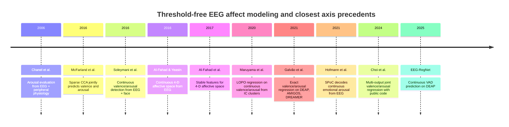

# EEG-Aligned Threshold-Free Affective Axis in EEG Emotion Recognition

## Executive summary

The closest prior art I found to your proposed idea is **McFarland et al.**: they used **sparse canonical correlation analysis** to jointly predict **continuous valence and arousal** from EEG features, and the paper explicitly interprets the **first canonical correlation on the label side as an “optimal weighted average of valence and arousal.”** That is the clearest precedent for a learned, EEG-linked affective direction in label space. However, it was **not DEAP**, it was **subject-specific rather than subject-independent**, and I did **not** find a public code release in the sources I located. citeturn37view0turn16search1turn38search3

For **DEAP specifically**, threshold-free continuous targets are **already established**: the main precedents I found are **continuous 4-D affective-space modeling** (Al-Fahad & Yeasin, 2016/2017, details partly recoverable via later citations), **exact valence/arousal regression** on **DEAP/AMIGOS/DREAMER** by **Galvão et al.** (2021), **joint multi-output valence/arousal regression** by **Choi et al.** (2024, with public GitHub code), and **continuous VAD regression** by **EEG-RegNet** (published in MDPI, subject-independent five-fold CV on DEAP). These papers show that **continuous regression is not new** on DEAP. What I did **not** find in the English primary sources and code I located is a **DEAP paper that explicitly learns a single scalar affect axis from continuous valence/arousal because that scalar is maximally predictable from EEG**. Existing DEAP regression papers predict **V and A separately**, **jointly**, or **VAD jointly**; they do not frame the target as a **rank-1 learned label projection** optimized for EEG predictability. citeturn29search1turn26view0turn7view2turn7view3turn41search0

That makes your most defensible novelty claim **not** “threshold-free EEG emotion regression” and **not** “joint valence/arousal prediction.” Those are already in the literature. The promising gap is this narrower claim: **a leakage-safe, fold-wise learned EEG-aligned latent affect axis derived from continuous valence/arousal labels, with strict subject-independent evaluation and stability analysis.** To make that claim convincing, you will need to show that your learned axis beats or meaningfully differs from strong baselines such as **valence alone**, **arousal alone**, **fixed 45° combinations** like \((V+A)/\sqrt{2}\) and \((V-A)/\sqrt{2}\), and **label PCA inside the training fold**. You should also audit **axis stability** across folds and datasets, because modern CCA/PLS papers warn that these methods can be unstable in modest sample regimes if not handled carefully. citeturn37view0turn16search1turn29search1turn26view0turn7view2turn5search3

## Closest precedents to an EEG-linked latent affect axis

The strongest conceptual predecessor is **McFarland et al.** Their setup is unusually close to what you want: EEG was recorded during affective picture viewing, valence and arousal ratings were continuous, and **sparse CCA** was used to **simultaneously predict both ratings**. The paper’s own summary describes the first canonical rating variate as the **optimal weighted average of valence and arousal**, which is effectively a learned affective axis. The important limitation is that this was a **subject-specific** modeling setup on IAPS pictures rather than a **subject-independent DEAP** study. citeturn37view0turn16search1turn35search3

A second important adjacent precedent is **Hofmann et al.** on immersive VR. They used **SPoC**, which is explicitly described as a **supervised regression approach** that uses a continuous target to guide the extraction of EEG components, and they applied it to **continuous emotional arousal**. This is not a valence-arousal label-space projection, but it is highly relevant methodologically because it demonstrates that **supervised EEG decompositions toward a single continuous affective dimension** are already accepted in the literature. That makes your proposal more plausible, but it also means novelty must come from the **two-dimensional label-space collapse from valence/arousal to one learned axis**, not merely from “single-score continuous decoding.” citeturn34view0turn32view0

A third adjacent line is **Maruyama et al.** They performed **leave-one-participant-out** regression analyses on **continuous valence and arousal** using EEG **independent-component clusters**, with separate regressions for high/low valence or arousal states. This is again not a learned single axis, but it is a real example of **subject-independent, continuous, EEG-to-affect regression** in the literature. That narrows the remaining gap further: what still appears missing is the **explicit rank-1 label-space target** learned from the valence/arousal pair for EEG predictability. citeturn40view0

By contrast, **CCA-family** methods in EEG emotion recognition have often been used for **channel selection or multimodal feature fusion**, not for learning a single continuous affect score from valence/arousal labels. For example, **Zheng’s GSCCA** line models relationships between class-label vectors and EEG features for recognition and channel selection, and **DCCA** has been used to coordinate representations from **EEG and eye movement**. Those are relevant as method-family precedents, but they are **not** the same as your proposed threshold-free label-space axis. citeturn15search1turn12search10turn35search15

## DEAP and similar EEG datasets where threshold-free targets are already used

On **DEAP and closely related EEG affect datasets**, threshold-free modeling is already well represented. The clearest example is **Galvão et al.**, who explicitly pose the problem as predicting the **exact values** of valence and arousal rather than thresholded classes, using **DEAP, AMIGOS, and DREAMER** in a **subject-independent 10-fold cross-validation** setup. Their reported best model used **KNN regression** with hand-crafted frequency and asymmetry features. This is a direct precedent for “don’t threshold the labels.” citeturn11search1turn10search5turn23search18

There is also a growing DEAP literature on **joint** continuous prediction rather than separate independent outputs. **Choi et al.** present **multi-output regression** for integrated valence/arousal prediction, and their public GitHub repository explicitly distinguishes a **DEAP subject-dependent notebook** (`DEAP_SD.ipynb`) from a **GAMEEMO subject-independent notebook** (`GAMEEMO_SI.ipynb`). That makes two things clear: joint V/A regression is already on the table, and public code exists at least for one recent line of work. citeturn26view0turn26view1turn25search1

At the deep-learning end, **EEG-RegNet** positions itself as **continuous VAD** prediction on DEAP and states that it uses a **subject-independent five-fold cross-validation** protocol, with continuous 1–9 ratings for valence, arousal, and dominance. Again, the paper’s contribution is **not** a learned scalar axis from the V/A pair; it is a **continuous multi-output regressive model** with a specialized loss. citeturn7view2turn7view3turn6view1

Finally, there is an older but relevant DEAP-adjacent line around **continuous 4-D affective space** from EEG: later papers and conference materials cite **Al-Fahad & Yeasin** on “robust modeling of continuous 4-D affective space from EEG recording” and follow-up work on “stable features” for that same task. I was able to verify the existence of those conference papers from later journal references and conference programs, but I could **not** directly inspect the full papers from the sources I found, so I would treat these as **confirmed precedents for continuous affect-space modeling**, but with incomplete recoverable detail on method and protocol. citeturn41search0turn41search6turn41search9turn41search11

## Comparison table

| Paper | Year | Dataset | Method | Target formulation | Eval protocol | Dummy baseline? | Code available? |
|---|---:|---|---|---|---|---|---|
| **McFarland et al., _Prediction of subjective ratings of emotional pictures by EEG features_** citeturn37view0turn16search1turn38search3 | 2017 | IAPS pictures + EEG | **Sparse CCA** | Continuous **valence + arousal jointly**; first canonical rating variate is a weighted VA axis | Subject-specific train/test; **not subject-independent** | Not reported | **No public repo found** in searched sources |
| **Soleymani et al., _Analysis of EEG Signals and Facial Expressions for Continuous Emotion Detection_** citeturn21view0turn22view0turn22view3 | 2016 | Custom video-viewing EEG + face dataset | MLR, SVR, CCRF, LSTM-RNN | Continuous valence/arousal traces | **10-fold CV, explicitly not participant-independent** | Not reported | No public project repo surfaced |
| **Zheng, _Multichannel EEG-Based Emotion Recognition via GSCCA_** citeturn15search1turn12search10turn12search7 | 2017 | SEED | **GSCCA** | **Discrete/thesholded class labels**, not continuous axis | Leave-one-trial-out on SEED; subject-independence unclear from accessible snippets | No | No public repo found |
| **Maruyama et al., _Independent Components of EEG Activity Correlating with Emotional State_** citeturn40view0 | 2020 | IAPS pictures + EEG | ICA + IC clustering + multiple linear regression | Continuous valence/arousal (normative ratings), separate regressions by affect regime | **Leave-one-participant-out** CV | No | No public repo found |
| **Galvão et al., _Predicting Exact Valence and Arousal Values from EEG_** citeturn11search1turn10search5turn23search18 | 2021 | **DEAP, AMIGOS, DREAMER** | Hand-crafted EEG features + KNN/RF regressors | Continuous **exact V/A** (threshold-free) | **Subject-independent 10-fold CV** | No explicit dummy baseline reported | No public repo found in searched sources |
| **Hofmann et al., _Decoding subjective emotional arousal from EEG during an immersive VR experience_** citeturn34view0turn32view0 | 2021 | Custom VR EEG dataset | **SPoC**, CSP, LSTM | Single continuous **arousal** score | Within-subject modeling; additional sub-blocked chronological CV checks; **not cross-subject** | No | **Partial**: method section links original SPoC implementation |
| **Choi et al., _Multi-Output Regression for Integrated Prediction of Valence and Arousal in EEG-Based Emotion Recognition_** citeturn26view0turn26view1turn25search1 | 2024 | **DEAP, GAMEEMO** | Multi-output regression / chain structure | Continuous **joint V/A** | Public repo shows **DEAP subject-dependent** notebook and **GAMEEMO subject-independent** notebook | No | **Yes, GitHub** |
| **Jon et al., _EEG-RegNet: Regressive Emotion Recognition in Continuous VAD Space Using EEG Signals_** citeturn7view2turn7view3turn6view1 | 2025 | **DEAP** | Deep regression with hybrid CE+MSE loss | Continuous **VAD** | **Subject-independent five-fold CV** | No dummy predictor; ablation baseline only | **No public repo found** in searched sources |
| **Al-Fahad & Yeasin, _Robust Modeling of Continuous 4-D Affective Space from EEG Recording_** citeturn41search0turn41search6turn41search11 | 2016 | Likely DEAP or similar EEG affect set | Continuous affect-space modeling | Continuous **4-D affective space** | Details not fully recoverable from accessible sources | Unknown | No public repo found |
| **Al-Fahad et al., _Selection of Stable Features for Modeling 4-D Affective Space from EEG Recording_** citeturn41search9turn41search11 | 2017 | Likely DEAP or similar EEG affect set | Stable-feature selection for continuous affect-space modeling | Continuous **4-D affective space** | Details not fully recoverable from accessible sources | Unknown | No public repo found |

The table points to a clear pattern. **Continuous EEG affect regression is established. Joint V/A regression is established. CCA-family and supervised EEG decomposition methods are established.** What is **not** clearly established in the sources I found is the exact combination you are asking about: **a fold-wise learned single label-space axis from continuous valence/arousal, optimized for EEG predictability, evaluated subject-independently on DEAP or a DEAP-like benchmark.** citeturn37view0turn29search1turn26view0turn7view2turn34view0



## Evaluation rigor, leakage, and code availability

The literature is mixed on methodological rigor. **McFarland** and **Maruyama** do appear to learn their EEG-to-label mappings on training data and evaluate them on held-out data, but the first is **subject-specific** and the second is **leave-one-participant-out** with no latent label projection beyond ordinary regression. **Soleymani** uses train/validation/test structure, but the paper explicitly says the 10-fold CV was **not participant-independent**, which limits cross-subject conclusions. **Galvão** and **EEG-RegNet** are the strongest DEAP-era examples I found that explicitly claim **subject-independent** evaluation for continuous targets. citeturn38search3turn40view0turn22view3turn10search5turn7view2

For your specific proposal, leakage control is much more central than in those papers because your **target itself is learned**. If you learn the valence/arousal projection using the full dataset before GroupKFold, the test-fold labels influence the target definition. That would be a real leakage channel. The axis must therefore be learned **inside every outer fold**, and if you tune the number of latent components or choose among alternative projection rules, that tuning must happen in an **inner grouped CV**. This is not just pedantry: recent work on CCA/PLS shows that estimated associations can be **unstable** in typical sample-size regimes if not regularized and validated carefully. citeturn5search3turn37view0turn34view0

On code availability, the best public artifact I found is **affctivai/MOR**, which includes code and explicitly identifies **DEAP subject-dependent** and **GAMEEMO subject-independent** notebooks. I also found open papers or open PDFs for **McFarland**, **Soleymani**, **Galvão**, and **Hofmann**, and Hofmann’s paper links the original **SPoC implementation** in its methods. I did **not** locate OSF or Zenodo releases for a DEAP latent-axis paper matching your proposal, and I did **not** locate public repos for McFarland, Galvão, Maruyama, or EEG-RegNet in the searched sources. citeturn26view0turn26view1turn21view0turn23search18turn34view0

## Gaps and novelty opportunities

The main gap is not “continuous labels” and not “joint V/A prediction.” Those boxes are already checked. The gap is **label-space optimization for physiological predictability**: instead of assuming that valence and arousal should be predicted as two endpoints, or thresholded into quadrants, you learn a **single scalar affect score** whose direction in \([V, A]\) space is estimated from training data because that direction is the one EEG can predict most reliably. None of the DEAP-specific papers I found formulates the problem this way. citeturn29search1turn26view0turn7view2turn37view0

A second gap is **rigorous fold-wise learning and reporting**. Much of the literature either stays subject-dependent, uses continuous targets without a learned label-space transformation, or uses CCA-like methods for other goals such as channel selection or multimodal fusion. A paper that makes the methodological point explicit — **“the affect axis itself is a supervised object and must be trained inside grouped CV folds”** — would be valuable even if the final performance gain is modest, because it would act as an **audit pipeline for whether a single EEG-predictable affect dimension even exists in DEAP-style data.** citeturn22view3turn15search1turn34view0turn5search3

A third gap is **stability and interpretability**. If you want to claim a meaningful new affect score rather than just a better benchmark number, you should show that the learned axis angle in the valence-arousal plane is **stable across folds**, **stable across datasets**, and not just collapsing to one trivial endpoint like “mostly arousal.” That kind of result would be scientifically useful whether the answer is positive or negative. If the learned fold-wise axis consistently aligns near arousal, that itself is publishable as an empirical constraint on what DEAP EEG can actually support. citeturn34view0turn40view0turn5search3

To make a novelty claim stick, I would frame it narrowly:

- **Not novel enough:** “We predict continuous valence and arousal from DEAP EEG.” Already done. citeturn29search1turn7view2
- **Still not enough:** “We jointly predict valence and arousal with a multi-output model.” Already done. citeturn26view0
- **Potentially novel:** “We learn, inside each training fold, a single EEG-aligned latent affect axis from continuous valence/arousal, audit whether it is stable and subject-independent, and compare it to fixed and unsupervised label projections.” That exact formulation did not surface in the sources I found. citeturn37view0turn29search1turn26view0turn7view2

## Suggested experiments for a defensible paper

I would make **DEAP** the primary benchmark and **AMIGOS** and **DREAMER** the external validation sets, because Galvão already ties those three together for threshold-free regression. If you can show the same fold-wise learned axis on all three datasets, your novelty claim becomes much stronger and much less likely to be dismissed as dataset-specific target engineering. citeturn11search1turn23search18

Your experimental ladder should include four model families. First, **fixed-axis baselines**: valence only, arousal only, \((V+A)/\sqrt{2}\), \((V-A)/\sqrt{2}\), and a simple equal-weight mean after z-scoring the two labels. Second, **unsupervised label-space baselines** fit inside the fold, especially **label PCA** on the training labels only. Third, **direct continuous baselines** that predict the full two-dimensional label vector, such as ridge, SVR, random forest, multi-task linear models, and if you want, the same regressors you already ran. Fourth, the **proposed supervised axis** learned by **PLS2 / rank-1 reduced-rank regression / CCA-style cross-decomposition** inside the training fold. Since your label dimension is only two, the axis can also be reported as an **angle in the VA plane**, which makes interpretation easy. citeturn37view0turn29search1turn26view0turn5search3

The core evaluation protocol should be **subject-grouped** throughout. Use **outer GroupKFold or leave-one-subject-out** for the main estimate, and **inner GroupKFold** for hyperparameter selection and component selection. Every step that touches the target — scaling, label PCA, PLS axis learning, sign alignment — must be fit on the **training fold only**. Report both **sample-wise** and **subject-wise averaged** metrics. The minimum metric set should include **MAE, RMSE, \(R^2\), Pearson, and Spearman** for the 1-D axis score, plus an auxiliary **2-D reconstruction error** if you also decode the original \((V, A)\) pair. Add an explicit **dummy baseline** that predicts the mean training-fold axis score; many papers still omit this, but for a first-principles paper it is essential. citeturn7view2turn10search5turn5search3

A convincing result section would have four plots: the **distribution of learned axis angles across folds**, **true-vs-predicted axis scores**, **comparison against fixed-axis baselines**, and **cross-dataset transfer**. If you can add EEG interpretability, report either PLS x-weights, channel-level permutation importance, or bootstrap confidence intervals on coefficient signs. The paper becomes stronger if you show that the fold-wise axis is either **consistent** or **honestly inconsistent**; both outcomes answer a real methodological question. citeturn34view0turn40view0turn5search3

## Minimal reproducible GroupKFold outline for a fold-wise PLS axis

The simplest leakage-safe implementation is: **fit a 2-output PLS model on the training fold only, extract the first label-side weight vector as the fold-specific affect axis, project both the true labels and the predicted labels onto that axis, and score in 1-D.** If you want to compare PLS to rank-1 reduced-rank regression or CCA, keep the outer protocol identical and change only the axis-learning block. The pseudocode below uses PLS because it is easy to reproduce in scikit-learn and gives you a label-side direction directly. The need for fold-wise fitting and stability checks is motivated by the general instability concerns around CCA/PLS in modest samples. citeturn5search3turn37view0

```python
# X: EEG feature matrix, shape [n_samples, p]
# Y: continuous labels, shape [n_samples, 2] -> columns = [valence, arousal]
# groups: subject IDs, shape [n_samples]

from sklearn.model_selection import GroupKFold
from sklearn.preprocessing import StandardScaler
from sklearn.cross_decomposition import PLSRegression
from sklearn.metrics import mean_absolute_error, mean_squared_error, r2_score
import numpy as np

def normalize(v):
    n = np.linalg.norm(v)
    return v / n if n > 0 else v

outer_cv = GroupKFold(n_splits=8)  # or LOSO
results = []

for outer_train, outer_test in outer_cv.split(X, Y, groups):
    X_tr, X_te = X[outer_train], X[outer_test]
    Y_tr, Y_te = Y[outer_train], Y[outer_test]
    g_tr = groups[outer_train]

    # fit all preprocessing on training fold only
    x_scaler = StandardScaler().fit(X_tr)
    y_scaler = StandardScaler().fit(Y_tr)

    X_tr_s = x_scaler.transform(X_tr)
    X_te_s = x_scaler.transform(X_te)
    Y_tr_s = y_scaler.transform(Y_tr)
    Y_te_s = y_scaler.transform(Y_te)

    # inner grouped CV to choose n_components
    best_k, best_score = None, -np.inf
    inner_cv = GroupKFold(n_splits=min(5, len(np.unique(g_tr))))

    for k in [1, 2, 3, 4]:
        fold_scores = []

        for inner_train, inner_val in inner_cv.split(X_tr_s, Y_tr_s, g_tr):
            Xi_tr, Xi_val = X_tr_s[inner_train], X_tr_s[inner_val]
            Yi_tr, Yi_val = Y_tr_s[inner_train], Y_tr_s[inner_val]

            pls = PLSRegression(n_components=k)
            pls.fit(Xi_tr, Yi_tr)

            # fold-specific label-space axis from training data only
            axis = normalize(pls.y_weights_[:, 0])

            # fix sign ambiguity on training data only
            if np.corrcoef(Yi_tr @ axis, Yi_tr[:, 0])[0, 1] < 0:
                axis = -axis

            Yhat_val = pls.predict(Xi_val)

            z_true = Yi_val @ axis
            z_pred = Yhat_val @ axis

            # choose one criterion; Pearson shown here
            corr = np.corrcoef(z_true, z_pred)[0, 1]
            if np.isnan(corr):
                corr = -1.0
            fold_scores.append(corr)

        mean_score = np.mean(fold_scores)
        if mean_score > best_score:
            best_score = mean_score
            best_k = k

    # refit on full training fold with chosen hyperparameter
    pls = PLSRegression(n_components=best_k)
    pls.fit(X_tr_s, Y_tr_s)

    axis = normalize(pls.y_weights_[:, 0])
    if np.corrcoef(Y_tr_s @ axis, Y_tr_s[:, 0])[0, 1] < 0:
        axis = -axis

    Yhat_te = pls.predict(X_te_s)

    z_true_te = Y_te_s @ axis
    z_pred_te = Yhat_te @ axis

    # dummy baseline for the learned axis
    z_dummy_te = np.full_like(z_true_te, fill_value=np.mean(Y_tr_s @ axis))

    fold_result = {
        "axis_angle_deg": float(np.degrees(np.arctan2(axis[1], axis[0]))),
        "mae": float(mean_absolute_error(z_true_te, z_pred_te)),
        "rmse": float(np.sqrt(mean_squared_error(z_true_te, z_pred_te))),
        "r2": float(r2_score(z_true_te, z_pred_te)),
        "pearson": float(np.corrcoef(z_true_te, z_pred_te)[0, 1]),
        "dummy_rmse": float(np.sqrt(mean_squared_error(z_true_te, z_dummy_te))),
    }
    results.append(fold_result)

# after CV:
# - report mean ± std across folds
# - plot distribution of axis_angle_deg
# - compare against fixed-axis and PCA-axis baselines learned in the same outer folds
```

If you want the paper to be especially clean, define the proposed method as **rank-1 supervised label projection** and implement three interchangeable backends:

1. **PLS-axis**: first `y_weights_` from fold-wise PLS2.  
2. **CCA-axis**: first label-side canonical vector from fold-wise regularized CCA.  
3. **RRR-axis**: rank-1 reduced-rank regression from \(X\) to \(Y\).

Then keep the same grouped outer/inner CV and compare them directly. That makes the paper less about a single algorithm and more about the **existence and stability of an EEG-predictable affect axis**, which is the scientifically stronger contribution. citeturn37view0turn34view0turn5search3

## Open questions and limitations

Some items remain incomplete because full texts were not always directly accessible in the sources I found. In particular, I could verify the existence of the **2016/2017 continuous 4-D affect-space** papers through later journal references and conference programs, but I could not directly inspect their full methodological details from the accessible sources. Also, for **Choi et al.**, I could inspect the public repository and author profile, but not the complete conference PDF from within the gathered sources. citeturn41search0turn41search6turn41search9turn26view0turn26view1

The central “novelty” conclusion is therefore best stated narrowly and honestly: **within the English primary-source papers, open PDFs, and public code artifacts I located, I did not find a DEAP-specific implementation of a single EEG-aligned label-space axis learned from continuous valence/arousal and trained fold-wise inside subject-grouped cross-validation.** The closest prior art is **McFarland’s sparse CCA weighted VA axis** outside DEAP, while DEAP papers themselves focus on **continuous exact V/A**, **joint multi-output V/A**, or **continuous VAD** rather than an explicit **rank-1 EEG-predictable affect score**. citeturn37view0turn16search1turn29search1turn26view0turn7view2